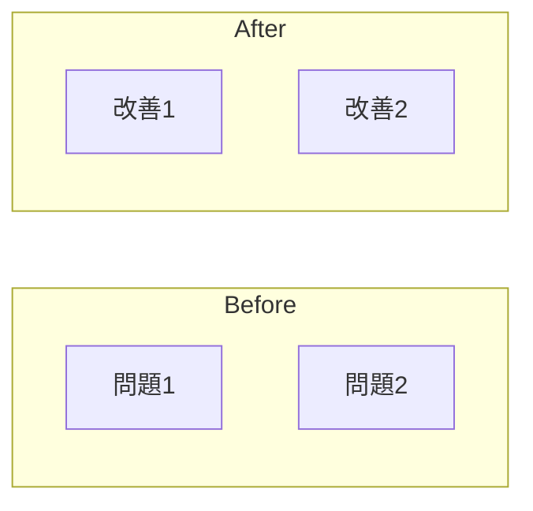

# 一頁投影片產生器

> 版本：v2.5

將素材（資料夾/PPTX/URL）轉換成專業的一頁投影片與演講稿。

## 執行流程

### Phase 1：設定詢問

使用**一次** AskUserQuestion 工具，同時詢問以下 4 個問題：

```json
{
  "questions": [
    {
      "question": "這份報告的目標聽眾是？",
      "header": "聽眾",
      "multiSelect": false,
      "options": [
        {"label": "L2 Manager+Tech (推薦)", "description": "管理層+技術背景，允許少量技術詞"},
        {"label": "L1 Executive", "description": "高層主管，最少術語，聚焦決策"},
        {"label": "L3 Technical", "description": "技術人員，可包含更多條件/假設"}
      ]
    },
    {
      "question": "請選擇報告模板：",
      "header": "模板",
      "multiSelect": false,
      "options": [
        {"label": "POC Report (推薦)", "description": "POC 報告，含實驗設計與成功判定準則"},
        {"label": "Executive", "description": "簡潔版，大字重點突出，適合高層"},
        {"label": "Technical", "description": "技術版，資訊密集，多區塊詳細說明"}
      ]
    },
    {
      "question": "這份報告需要什麼程度的佐證？",
      "header": "佐證",
      "multiSelect": false,
      "options": [
        {"label": "E0 使用現有數據 (預設)", "description": "不要求新實驗，使用素材中的現有數據"},
        {"label": "E1 輕佐證", "description": "需要 1-2 個關鍵指標（如 FPS、功耗）"},
        {"label": "E2 強佐證", "description": "需要完整實驗設計與數據"}
      ]
    },
    {
      "question": "需要幾輪審稿？",
      "header": "審稿",
      "multiSelect": false,
      "options": [
        {"label": "1 輪 (預設)", "description": "單輪審稿"},
        {"label": "3 輪", "description": "審稿→重寫→審稿，最多三輪"},
        {"label": "自訂", "description": "輸入自訂次數"}
      ]
    }
  ]
}
```

使用者回答後，再**單獨詢問**報告目的（因為這是文字輸入）：

```json
{
  "questions": [
    {
      "question": "這份報告想要達成什麼？（範例：核准 POC、申請加人、採用方案 A、核准預算）",
      "header": "目的",
      "multiSelect": false,
      "options": [
        {"label": "核准 POC", "description": "請主管核准進行概念驗證"},
        {"label": "申請資源", "description": "申請人力、預算或設備"},
        {"label": "採用方案", "description": "建議採用特定技術方案"},
        {"label": "知會進度", "description": "報告專案進度或成果"}
      ]
    }
  ]
}
```

如果使用者在「審稿」選擇「自訂」，再追問具體次數。

記錄使用者的選擇：
- `LEVEL`：L1 / L2 / L3
- `PURPOSE`：報告目的
- `EVIDENCE`：E0 / E1 / E2
- `TEMPLATE`：Executive / Technical / POC
- `MAX_ITERATIONS`：正整數（預設 1）

---

### Phase 2：讀取素材

根據 `{input_path}` 判斷輸入類型並處理：

#### 2.1 判斷輸入類型

| 輸入格式 | 判斷條件 | 處理方式 |
|----------|----------|----------|
| 資料夾 | 路徑是目錄 | 掃描 .txt/.md/.pptx/.pdf 檔案 |
| PPTX 檔案 | 以 .pptx 結尾 | 使用 extract_pptx.py 抽取 |
| PDF 檔案 | 以 .pdf 結尾 | 使用 extract_pdf.py 抽取 |
| URL | 以 http:// 或 https:// 開頭 | 使用 WebFetch 抓取 |

#### 2.2 資料夾處理

1. 使用 Glob 工具掃描資料夾內的檔案：
   ```
   Glob: {input_path}/**/*.txt
   Glob: {input_path}/**/*.md
   Glob: {input_path}/**/*.pptx
   Glob: {input_path}/**/*.pdf
   ```

2. 對於 .txt/.md 檔案：使用 Read 工具讀取內容

3. 對於 .pptx 檔案：
   - 先詢問使用者要抽取哪些投影片
   - 執行 extract_pptx.py 抽取內容：
   ```bash
   python {skill_dir}/scripts/extract_pptx.py {pptx_file} ./temp_extract/ --slides "{slide_range}"
   ```
   - 讀取 ./temp_extract/text.md 作為素材

4. 對於 .pdf 檔案：
   - 先詢問使用者要抽取哪些頁面，是否需要 OCR
   - 執行 extract_pdf.py 抽取內容：
   ```bash
   python {skill_dir}/scripts/extract_pdf.py {pdf_file} ./temp_extract/ --pages "{page_range}" [--ocr]
   ```
   - 讀取 ./temp_extract/text.md 作為素材

#### 2.3 單一 PPTX 檔案處理

1. 先列出投影片清單讓使用者選擇：
   ```bash
   python {skill_dir}/scripts/extract_pptx.py {input_path} --list
   ```

2. 使用 AskUserQuestion 詢問：
   ```
   以下是 PPTX 的投影片清單：

   {slide_list}

   請輸入要抽取的投影片範圍：
   - 範例："1-5" 或 "1,3,5,7" 或 "1-3,7,10-12"
   - 留空表示全部抽取
   ```

3. 執行抽取：
   ```bash
   python {skill_dir}/scripts/extract_pptx.py {input_path} ./temp_extract/ --slides "{slide_range}"
   ```

4. 讀取 ./temp_extract/text.md 作為素材

#### 2.4 單一 PDF 檔案處理

1. 先列出頁面清單讓使用者選擇：
   ```bash
   python {skill_dir}/scripts/extract_pdf.py {input_path} --list
   ```

2. 使用 AskUserQuestion 詢問：
   ```
   以下是 PDF 的頁面清單：

   {page_list}

   請輸入要抽取的頁碼範圍：
   - 範例："1-5" 或 "1,3,5,7" 或 "1-3,7,10-12"
   - 留空表示全部抽取

   是否啟用 OCR？（適用於掃描文件）
   1. 否（預設）
   2. 是
   ```

3. 執行抽取：
   ```bash
   python {skill_dir}/scripts/extract_pdf.py {input_path} ./temp_extract/ --pages "{page_range}" [--ocr]
   ```

4. 讀取 ./temp_extract/text.md 作為素材

#### 2.5 URL 處理

1. 使用 WebFetch 工具抓取網頁內容：
   ```
   WebFetch: {input_path}
   prompt: 請抽取這個網頁的主要內容，包括標題、重點、數據等。忽略導覽列、廣告、頁尾等。
   ```

2. 將抓取的內容整理成素材格式

#### 2.5 整理素材

將所有來源的內容整理成統一格式：

```
=== 素材彙整 ===

--- 來源：{source1}（{type1}）---
{content1}

--- 來源：{source2}（{type2}）---
{content2}
```

其中 type 可以是：txt、md、pptx:slide=1-5、url

#### 2.6 建立 Citation Map

為每個素材段落建立 citation ID，方便追溯來源：

```markdown
## Citation Map

### C1
- **來源**：notes.md
- **位置**：第 1-5 行
- **原文**：Framepacing V2 透過SF queue來用部份延遲換部份功耗...

### C2
- **來源**：notes.md
- **位置**：第 6-10 行
- **原文**：傳統方法透過拉高 CPU 頻率來維持 99% 不掉幀率...

### C3
- **來源**：presentation.pptx:slide=3
- **位置**：shape 2
- **原文**：BufferTX 緩衝池可維持 0-3 個緩衝幀...
```

建立規則：
- 每個有實質內容的段落都給一個 citation ID（C1, C2, C3...）
- 記錄來源檔案、位置、原文摘要
- 後續 Phase 3 產出內容時引用這些 ID

---

### Phase 3：產生初稿

根據素材內容與使用者設定，產生三到四份文件。

#### 3.0 模板選擇

根據 `TEMPLATE` 設定選擇對應的格式。

**Executive 模板**（簡潔版）
- 區塊：標題 + 關鍵要點（3點）+ 預期效益 + 行動
- 特色：大字、少文字、重點突出
- 適用：高層主管、快速決策

**Technical 模板**（技術版）
- 區塊：標題 + 背景/問題 + 技術方案 + 證據/數據 + 影響 + 行動
- 特色：資訊密集、多區塊、詳細說明
- 適用：技術審查、架構討論

**POC Report 模板**（POC 報告）
- 區塊：標題 + 已驗證成功要素 + 現況問題 + 技術關鍵點 + 對照表 + POC 設計 + 成功判定準則 + 行動
- 特色：完整邏輯鏈、實驗設計、判定標準
- 適用：POC 申請、技術驗證

#### 3.1 產生 one_page.md

根據 `TEMPLATE` 選擇對應格式，並依素材提取內容。

---

**Executive 模板格式：**

```markdown
# {結論標題，<=30字，要有數字或明確結論}

## 關鍵要點
1. **{要點1標題}**：{說明，<=50字}
2. **{要點2標題}**：{說明，<=50字}
3. **{要點3標題}**：{說明，<=50字}

## 預期效益
- {效益 1，量化優先}
- {效益 2}

## 行動
{一句話決策建議，<=50字}
```

---

**Technical 模板格式：**

```markdown
# {結論標題，<=50字}
{副標題：技術方案說明，<=60字}

## 背景與問題
- {問題 1，<=60字}
- {問題 2，<=60字}

## 技術方案
- {方案要點 1，<=60字}
- {方案要點 2，<=60字}
- {方案要點 3，<=60字}

## 證據與數據
- {數據 1，含具體數字} [C1]
- {數據 2，含具體數字} [C2]

## 影響評估
- {正面影響}
- {潛在風險/限制}

## 行動建議
{決策建議，<=80字}
```

---

**POC Report 模板格式（預設）：**

根據素材，提取並整理成 MTK 風格的內容格式：

```markdown
# {結論標題，<=50字，要有數字或明確結論}
{副標題：靈感來源或目標說明，<=80字}

## 已驗證的成功要素
{說明 PC/Server 平台或業界已驗證有效的前提條件}
- {要素 1，<=60字} [C1]
- {要素 2，<=60字} [C2]
- {要素 3，<=60字} [C3]
- {已驗證的效果，含具體數字} [C4]

## 現況與問題
{說明目前平台（如 Dimensity）的現況與瓶頸}
- {現況/問題 1，<=60字} [C5]
- {現況/問題 2，<=60字} [C6]
- {現況/問題 3，<=60字} [C7]

## 技術關鍵點 / 為何可能有效
{說明為何在手機平台可能有類似效果}
- {關鍵點 1，<=60字} [C8]
- {關鍵點 2，<=60字} [C9]
- {推論結論，<=80字} [C10]

## 對照表（可選）
| 比較項目 | PC 平台 | 手機平台 |
|----------|---------|----------|
| {項目1}  | {PC做法} | {手機做法} |
| {項目2}  | {PC做法} | {手機做法} |

## 預期效益
- {效益 1，量化優先，<=60字}
- {效益 2，<=60字}
- {效益 3，<=60字}

## POC 設計
實驗條件：
- A 組 (Baseline)：{現行方案}
- B 組 (Experimental)：{新方案}

遊戲場景：
- {場景 1}
- {場景 2}

## 成功判定準則
1. {判定項目 1}
   {具體指標與門檻}
2. {判定項目 2}
   {具體指標與門檻}
3. {判定項目 3}
   {具體指標與門檻}

## 行動
{決策建議，<=80字，需符合報告目的，可包含時程/條件}
```

**內容密度原則（MTK 風格）：**
- 一頁投影片要有足夠資訊量，讓主管能做決策
- 每個 bullet 都要有實質內容，不要空泛
- 數字要具體（不要「大幅改善」，要「改善 81%」）
- 可以有 3-4 個 bullet，不用限制只有 2 個
- 要有「已驗證」→「現況問題」→「為何可行」→「POC 設計」→「成功判定」的邏輯鏈

**區塊可根據內容彈性調整：**
- 如果不是技術 POC 題目，可以省略「已驗證的成功要素」
- 如果沒有對照需求，可以省略「對照表」
- 核心區塊：標題、現況/問題、證據/效益、行動

**撰寫原則（依專業程度調整）：**

| 等級 | 用詞 | 內容深度 | 重點 |
|------|------|----------|------|
| L1 Executive | 最精簡，避免術語 | 只講結果與決策 | 能不能做、要不要做 |
| L2 Manager+Tech | 可用少量術語 | 平衡技術與決策 | 為什麼這樣做 |
| L3 Technical | 可用技術詞彙 | 包含條件與假設 | 怎麼做、細節 |

**標題撰寫原則：**
- 必須是結論句，不是主題句
- 好：「導入快取可降低 80% 回應時間」
- 壞：「系統效能改善方案」

#### 3.2 產生 diagram.md

根據內容選擇適合的圖表類型：

**flow（流程圖）** - 適合說明步驟、流程改變

````markdown
## 圖表類型
flow

## Mermaid

````

**before_after（前後對比）** - 適合說明改善、變化

````markdown
## 圖表類型
before_after

## Mermaid

````

**選擇原則：**
- 有明確步驟/流程 → flow
- 有明確改善/對比 → before_after
- 圖表文字要精簡（每個節點 <=10 字）

#### 3.3 產生 table.md（如有數據比較時）

當素材中包含數據比較（Before/After、多方案對比、指標比較）時，產生表格：

**判斷是否需要表格：**
- 素材中有 Before/After 數據
- 素材中有多個方案的指標比較
- 素材中有時間序列的變化數據
- 使用者設定 E1/E2（需要實驗數據）

**table.md 格式：**

```markdown
## 指標比較表

| Metric | Baseline | Experimental | Delta | 說明 |
|--------|----------|--------------|-------|------|
| FPS_avg | 60 fps | 66 fps | +10% | 平均幀率提升 |
| FPS_1%low | 45 fps | 52 fps | +16% | 最低幀更穩定 |
| Power | 900 mW | 820 mW | -9% | 功耗降低 |
| Jank | 15 次 | 3 次 | -80% | 掉幀大幅減少 |

**測試條件**：
- 裝置：Dimensity 9300
- 場景：原神璃月港
- 時長：120 秒
```

**表格設計原則：**
- 欄位數量：4-6 欄（太多會擠）
- 行數：3-8 行（太多考慮分組）
- Delta 欄：自動計算，顯示百分比或差值
- 重要數據可用粗體標示

#### 3.4 產生 script.md

演講稿，每段標註要看投影片的哪個區塊：

```markdown
## 開場（看 TITLE）
{開場白，說明報告主旨，2-3 句}

## 說明背景（看 背景）
{背景說明，為什麼要做這件事，2-3 句}

## 說明流程/變化（看 DIAGRAM）
{解釋圖表，說明流程或前後差異，3-4 句}

## 關鍵數據（看 證據）
{說明證據與數據來源，2-3 句}

## 影響說明（看 影響）
{說明這樣做的影響，2-3 句}

## 結論（看 行動）
{總結並說明需要的決策，1-2 句，呼應報告目的}
```

---

### Phase 4：主管審稿

模擬 VP/Director 角度審視初稿，找出潛在問題。

#### 審稿檢查清單

逐一檢查以下項目：

**1. 結論是否過強？**
- 標題的宣稱是否有足夠證據支持？
- 例：說「降低 80%」但素材只說「預估可降低」
- 修正方向：加上「預估」「初步測試顯示」「在特定條件下」

**2. 數字是否有來源？**
- 證據中的數字在素材中有明確提到嗎？
- 如果是推算的，有說明計算方式嗎？
- 修正方向：標注來源或說明計算

**3. 條件/範圍是否明確？**
- 適用於什麼場景？什麼情況下有效？
- 有什麼前提條件或限制？
- 修正方向：補充適用範圍

**4. 行動是否缺前提或風險？**
- 直接「全面採用」還是應該「先做 POC」？
- 有沒有潛在風險沒提到？
- 修正方向：加上前提條件或風險說明

**5. 術語是否符合專業程度？**
- L1 不該出現技術術語
- L2 術語需簡單或有對照說明
- L3 可以直接使用技術詞彙

**6. 關鍵術語是否有解釋？**
- 報告中出現的專有名詞，讀者能理解它「是什麼」和「為何重要」嗎？
- 數字或指標有說明「代表什麼意義」嗎？

**術語解釋自檢：**
```
對報告中每個專有名詞/機制/指標，問：
1. 它是什麼？（定義）
2. 它在這份報告中扮演什麼角色？（關聯性）
3. 讀者不懂這個詞，還能理解報告嗎？（必要性）
```

**常見未解釋術語問題：**

| 問題模式 | 範例 | 修正方向 |
|----------|------|----------|
| 機制名稱無定義 | 「BufferTX 維持 2.2±0.4」 | 補充「BufferTX 是緩衝幀數，2.2 表示平均保持 2 幀緩衝」 |
| 階段名稱無關聯 | 「UE5 五階段時間點」 | 補充「這五個時間點可用於預測下一幀完成時間」 |
| 指標無意義說明 | 「Jank 降低 80%」 | 補充「Jank 是掉幀次數，降低代表畫面更流暢」 |
| 縮寫無展開 | 「SF queue 機制」 | 補充「SF (SurfaceFlinger) 是 Android 的合成器」 |

**修正原則：**
- 首次出現時給一句話定義（不用太長）
- 說明它跟報告主題的關係
- L1/L2 聽眾：用類比或白話解釋
- L3 聽眾：可簡短帶過，但仍需點出關聯性

**7. 邏輯鏈是否完整？（最重要）**
- 從「已驗證成功要素」到「結論/行動」，每一步推論是否都有明確依據？
- 是否有「跳躍式結論」？（直接從問題跳到解法，沒解釋為何這個解法有效）
- 是否有「隱藏假設」？（推論依賴了沒說明的前提）

**邏輯鏈自檢流程：**
```
步驟 1：列出報告的推論鏈
   [前提 A] → [推論 B] → [推論 C] → [結論 D]

步驟 2：逐一檢查每個箭頭
   - A → B：為什麼 A 可以推出 B？有證據嗎？
   - B → C：為什麼 B 可以推出 C？有證據嗎？
   - C → D：為什麼 C 可以推出 D？有證據嗎？

步驟 3：標記斷鏈處
   - 如果某個箭頭無法解釋，標記為「邏輯斷鏈」
   - 必須補上說明或弱化結論
```

**常見邏輯斷鏈模式：**

| 斷鏈模式 | 範例 | 修正方向 |
|----------|------|----------|
| 類比跳躍 | 「PC 上有效 → 手機也會有效」 | 補充「因為 X 機制相同」或「需 POC 驗證」 |
| 數據跳躍 | 「測試 A 改善 20% → 全面採用」 | 補充「A 場景代表性」或「需更多場景驗證」 |
| 因果混淆 | 「同時發生 → 所以是原因」 | 補充因果機制說明或降級為「相關性」 |
| 選擇性引用 | 「只提有利數據」 | 補充限制條件或不利情況 |
| 規模跳躍 | 「小規模成功 → 大規模也行」 | 補充規模化考量或需階段驗證 |

**修正方向：**
- 補上缺失的推論步驟（用 [Cn] 引用素材）
- 明確說明假設前提
- 如果無法補齊，弱化結論：「初步顯示」「在 X 條件下」「仍需驗證」
- 最差情況：標記為「邏輯待補強」並建議做 POC

**8. 金字塔結構是否成立？**
- 報告中的所有內容，是否都指向標題宣稱的結論？
- 有沒有「離題內容」？（跟結論無關，放了也沒用）
- 有沒有「重複論點」？（兩個 bullet 說的是同一件事）
- 有沒有「缺漏論點」？（結論需要但沒提到的支撐）

**金字塔自檢流程：**
```
步驟 1：寫出標題結論
   「導入 Framepacing V2 可降低功耗 15% 且不影響流暢度」

步驟 2：列出報告中所有論點
   A. PC 平台已驗證有效
   B. BufferTX 機制可維持緩衝
   C. 手機 GPU 利用率偏低
   D. 預估可省 15% 功耗
   E. UE5 有五階段時間點

步驟 3：逐一檢查每個論點
   - A 支撐結論嗎？✓ 說明技術可行性
   - B 支撐結論嗎？✓ 說明機制原理
   - C 支撐結論嗎？✓ 說明問題現況
   - D 支撐結論嗎？✓ 直接支撐「降低功耗」
   - E 支撐結論嗎？✗ 跟結論什麼關係？

步驟 4：標記問題
   - E 是離題內容，需刪除或補上關聯說明
```

**常見金字塔問題：**

| 問題類型 | 症狀 | 修正方向 |
|----------|------|----------|
| 離題內容 | 論點跟結論無關 | 刪除，或補上「這跟結論的關係是...」 |
| 重複論點 | 兩個 bullet 說同一件事 | 合併，或區分角度 |
| 缺漏論點 | 結論需要但沒提 | 補上，或弱化結論 |
| 結論過大 | 論點撐不起結論 | 縮小結論範圍 |

**MECE 檢查（互斥且窮盡）：**
- 互斥：每個論點是否獨立？（不重複）
- 窮盡：支撐結論需要的論點是否都有了？（不遺漏）

#### 產出 Issue List

將發現的問題整理成以下格式，並分類處理方式：

```markdown
## 審稿結果

我以主管角度審視了初稿，發現以下需要確認的問題：

### Q1：{問題標題}
- **類型**：{missing_evidence | ambiguity | inconsistency | decision_risk | undefined_term | logic_gap | pyramid_violation}
- **問題**：{具體描述問題}
- **位置**：{標題/證據/影響/行動/圖表}
- **斷鏈分析**（如為 logic_gap）：
  - 推論鏈：{A} → {B} → {C}
  - 斷鏈處：{B} → {C}
  - 缺失：{缺少什麼才能連上}
- **處理**：{material | web_research | experiment | user_input}
- **建議**：{修正方向}

### Q2：{問題標題}
- **類型**：{類型}
- **問題**：{具體描述問題}
- **位置**：{位置}
- **處理**：{處理方式}
- **建議**：{修正方向}
```

**處理方式分類：**

| 處理方式 | 說明 | 動作 |
|----------|------|------|
| material | 素材內可回答 | 直接引用素材修正 |
| web_research | 需網路查證 | 進入 Phase 4.5 |
| experiment | 需實驗佐證 | 產出 Experiment Plan |
| user_input | 需使用者補充 | 詢問使用者 |

如果有 `web_research` 類型的 Issue，先進入 Phase 4.5。

---

### Phase 4.5：網路查證（如需要）

當有 Issue 需要網路查證時執行此步驟。

#### 查證流程

1. 使用 WebSearch 工具搜尋相關資訊：
   ```
   WebSearch: {關鍵字}
   ```

2. 使用 WebFetch 抓取 2-3 個可信來源的內容

3. 整理查證結果：

```markdown
## 網路查證結果

### {Issue Q1 關鍵字}

#### 來源 1：{source_title}
- **網址**：{url}
- **摘要**：{重點摘要}

#### 來源 2：{source_title}
- **網址**：{url}
- **摘要**：{重點摘要}

#### 結論
- **可信度**：support | conflict | unclear
- **說明**：{一致/衝突點說明}
- **建議處理**：{如何修正內容}
```

#### 查證結果使用規則

| 可信度 | 處理方式 |
|--------|----------|
| support | 可用於加強證據說明，但仍標注「業界資料顯示」 |
| conflict | 弱化結論，加註「有不同看法」或「仍需驗證」 |
| unclear | 保守處理，建議「先做 POC」驗證 |

**重要**：網路查證結果不能直接當作新證據，只能用於：
- 弱化/加條件
- 建議使用者補充
- 調整行動建議

---

### Phase 4.6：實驗計畫（E1/E2 或需實驗佐證時）

當符合以下條件時執行此步驟：
- 使用者選擇 E1 或 E2 佐證強度
- Issue 類型為 `experiment`（需實驗佐證）

#### 產出 Experiment Plan

根據報告內容與缺少的佐證，產出實驗計畫：

```markdown
## 實驗計畫

為了補強本報告的佐證，建議進行以下實驗：

### E1：{實驗目標}

#### 目標
{要證明什麼}

#### 實驗設定
- **裝置**：{型號/SoC}
- **版本**：{軟體版本號}
- **場景**：{測試場景/關卡}
- **時長**：{測試時長} 秒

#### 量測指標
| 指標 | 單位 | 說明 |
|------|------|------|
| {指標1} | {單位} | {說明} |
| {指標2} | {單位} | {說明} |

#### 量測方法
{如何量測，使用什麼工具/指令}

#### 回填表格
請完成實驗後，回填以下表格：

| Metric | Baseline | Experimental | Delta |
|--------|----------|--------------|-------|
| {指標1} | | | |
| {指標2} | | | |

---

請完成實驗並回填數據，或選擇：
1. 提供實驗數據（回填上表）
2. 跳過實驗，弱化結論
3. 修改實驗設計
```

#### E1 vs E2 差異

| 項目 | E1 輕佐證 | E2 強佐證 |
|------|----------|----------|
| 指標數量 | 1-2 個關鍵指標 | 3-5 個完整指標 |
| 場景數量 | 1 個代表場景 | 2-3 個不同場景 |
| 重複次數 | 1 次 | 3 次取平均 |
| 統計要求 | 無 | 標準差、信心區間 |

#### 處理使用者回填的數據

當使用者回填實驗數據後：
1. 自動計算 Delta（變化量/百分比）
2. 更新 one_page.md 中的證據區塊
3. 在 citations.md 中新增實驗來源

---

### Phase 4.7：詢問使用者

將需要使用者回答的問題整理後詢問：

```markdown
## 需要您確認的問題

### Q1：{問題標題}
- **問題**：{具體描述問題}
- **建議**：{修正方向}

請回答：
1. 同意修正建議
2. 提供補充資訊：{你的補充}
3. 維持原樣，原因：{你的原因}

### Q2：...
```

等待使用者回答後，進入 Phase 5。

---

### Phase 5：根據回饋重寫

根據使用者對 Issue List 的回答，修正初稿。

**修正策略：**

| 使用者回答 | 處理方式 |
|------------|----------|
| 同意修正 | 按建議修改 |
| 提供補充 | 整合新資訊後修改 |
| 維持原樣 | 保留，但考慮是否需加註條件 |

**禁止事項：**
- 不可硬撐沒有證據的結論
- 不可隱藏矛盾
- 不可在沒數字時寫具體百分比
- 不可忽略使用者提供的補充資訊

重新產生：
- one_page.md（修正版）
- diagram.md（如需調整）
- script.md（配合修正內容）

---

### Phase 5.5：多輪審稿迭代（如 MAX_ITERATIONS > 1）

當使用者設定多輪審稿時，重複 Phase 4 → Phase 5 流程。

#### 迭代邏輯

```
迭代計數 = 1

WHILE 迭代計數 <= MAX_ITERATIONS:
    執行 Phase 4（審稿）

    IF 審稿通過（無 Issue 或全部為 minor）:
        BREAK  # 進入 Phase 6

    IF 迭代計數 == MAX_ITERATIONS:
        強制保守輸出
        BREAK

    執行 Phase 4.5~4.7（查證/實驗/詢問）
    執行 Phase 5（重寫）
    迭代計數 += 1
```

#### 強制保守輸出（達到 MAX_ITERATIONS 仍有問題時）

當達到最大迭代次數但仍有未解決的 Issue 時：

1. **弱化所有未解決的宣稱**
   - 標題加「初步」「在特定條件下」
   - 數字加「約」「估計」
   - 結論加「仍需驗證」

2. **加入風險註記**
   ```markdown
   ## 風險與限制
   - {未解決 Issue 1}：{風險說明}
   - {未解決 Issue 2}：{風險說明}
   ```

3. **調整行動建議**
   - 「全面採用」→「建議先做 POC 驗證」
   - 「立即執行」→「待補充佐證後再決定」

4. **告知使用者**
   ```
   ⚠️ 注意：本報告經過 {N} 輪審稿，仍有以下問題未完全解決：
   - {Issue 1}
   - {Issue 2}

   已自動採取保守處理，建議：
   1. 補充更多佐證後再報告
   2. 或以目前保守版本先行報告，說明後續會補充
   ```

---

### Phase 6：渲染輸出

#### 6.1 建立輸出目錄

```bash
mkdir -p ./output
```

#### 6.2 儲存 diagram.md 並產生 PNG

1. 將 diagram.md 內容儲存到 `./output/diagram.md`
2. 執行 render_diagram.py：

```bash
python {skill_dir}/scripts/render_diagram.py ./output/diagram.md ./output/diagram.png
```

其中 `{skill_dir}` 是此 skill 所在的目錄路徑。

#### 6.3 產生 PPTX

這是最關鍵的步驟。你需要：

1. 讀取 `{skill_dir}/scripts/pptx_reference.py` 了解 python-pptx API 用法

2. 根據 one_page.md 的內容，動態產生 Python 程式碼

3. **佈局決策原則**：
   - 圖表與相關說明要放在一起
   - 根據內容量決定佈局（不要固定）
   - 證據多 → 可能需要左右分欄
   - 圖表複雜 → 給圖更多空間
   - 字體大小根據內容量調整（但不小於 10pt）
   - **有表格時**：表格放在投影片下方或右側，參考 pptx_reference.py 的 `add_table()` 函數

4. 將產生的程式碼儲存到 `./output/render_this.py`

5. 執行產生 PPTX：

```bash
cd ./output && python render_this.py
```

**render_this.py 的基本結構：**

```python
from pptx import Presentation
from pptx.util import Inches, Pt
from pptx.dml.color import RgbColor
from pptx.enum.text import PP_ALIGN
from pptx.enum.shapes import MSO_SHAPE

# 建立簡報
prs = Presentation()
prs.slide_width = Inches(13.333)
prs.slide_height = Inches(7.5)

# 加入空白投影片
slide = prs.slides.add_slide(prs.slide_layouts[6])

# === 根據內容動態產生以下程式碼 ===

# 標題
# ...

# 圖片
# ...

# 各區塊（背景、證據、影響、行動）
# ...

# === 加入演講稿到投影片備註 ===
speaker_notes = """
## 開場（看 TITLE）
{開場白內容}

## 說明背景（看 背景）
{背景說明內容}

## 說明流程/變化（看 DIAGRAM）
{圖表說明內容}

## 關鍵數據（看 證據）
{證據說明內容}

## 影響說明（看 影響）
{影響說明內容}

## 結論（看 行動）
{結論內容}
"""

notes_slide = slide.notes_slide
notes_slide.notes_text_frame.text = speaker_notes

# 儲存
prs.save('one_page.pptx')
print('Saved to one_page.pptx')
```

**重要**：演講稿內容必須嵌入到 `speaker_notes` 變數中，並透過 `slide.notes_slide.notes_text_frame.text` 寫入投影片備註。

#### 6.4 輸出演講稿

將最終版 script.md 儲存到 `./output/speaker_script.md`

**注意**：演講稿會同時存在兩處：
1. PPTX 投影片的備註欄（方便簡報時直接看）
2. `./output/speaker_script.md` 獨立檔案（方便編輯或列印）

#### 6.5 輸出來源引用

將 Citation Map 儲存到 `./output/citations.md`，格式如下：

```markdown
# 來源引用清單

本報告引用的素材來源：

## C1
- **來源**：notes.md
- **位置**：第 1-5 行
- **原文**：Framepacing V2 透過SF queue來用部份延遲換部份功耗...
- **引用於**：已驗證的成功要素 - 第 1 點

## C2
- **來源**：notes.md
- **位置**：第 6-10 行
- **原文**：傳統方法透過拉高 CPU 頻率...
- **引用於**：已驗證的成功要素 - 第 2 點

...
```

#### 6.6 完成

告知使用者：

```
報告產生完成！

輸出檔案：
📊 ./output/one_page.pptx（一頁投影片，含備註欄演講稿）
📝 ./output/speaker_script.md（演講稿獨立檔案）
🖼️ ./output/diagram.png（圖表）
📚 ./output/citations.md（來源引用）

建議：
1. 開啟 PPTX 確認排版
2. 簡報時可開啟「簡報者檢視畫面」查看備註欄的演講稿
3. 如需調整，可以直接編輯 PPTX
4. 如被問「這數字哪來的？」，可查閱 citations.md
```

---

## 錯誤處理

### Mermaid 渲染失敗

如果 render_diagram.py 執行失敗：

1. 檢查 mermaid-cli 是否安裝：`npm list -g @mermaid-js/mermaid-cli`
2. 如果未安裝，提示使用者：`npm install -g @mermaid-js/mermaid-cli`
3. 如果仍失敗，改用 python-pptx shapes 畫簡單流程圖

### PPTX 渲染失敗

如果 render_this.py 執行失敗：

1. 檢查錯誤訊息
2. 修正程式碼後重新執行
3. 如果多次失敗，使用簡化佈局

### 素材不足

如果素材中缺少必要資訊：

1. 在審稿階段指出缺少什麼
2. 請使用者補充
3. 不可憑空捏造數據
